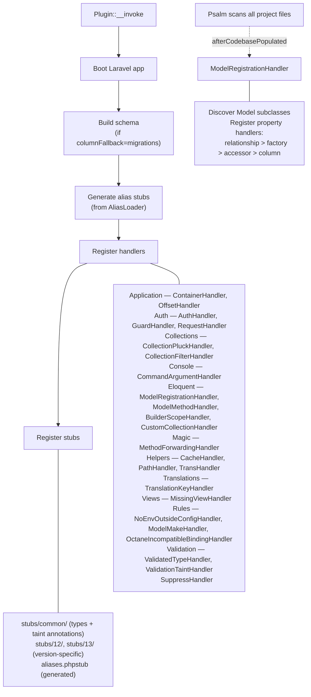

# Contributing

## How the plugin works

The plugin boots a Laravel application, then hooks into Psalm's event system to override type inference for Laravel APIs.

The app is needed at boot time to read config values (e.g. `auth.php` guards), resolve facade aliases via `AliasLoader`, and load service providers.
When run inside a Laravel project, the plugin loads the project's own `bootstrap/app.php` — so it sees the real config, routes, and providers.
When no `bootstrap/app.php` is found (e.g. analyzing a Laravel package, or running the plugin's own tests), it falls back to [Orchestra Testbench](https://github.com/orchestral/testbench) which provides a minimal Laravel app skeleton.

See `ApplicationProvider::getApp()` for the resolution logic and the recorded boot context.

### Laravel app boot strategy

Application boot has three outcomes:

1. **Full boot** — `bootstrap/app.php` or Testbench returns an app and the console kernel bootstrap completes. All container-backed features may run.
2. **Partial boot** — an app object exists, but Laravel's analysis prep or kernel bootstrap throws, usually because `config/*.php`, `.env`-dependent code, the container, or a service provider is broken. The plugin records that throwable on `ApplicationProvider`, warns once through `ApplicationBootReporter`, keeps the partial app, and feature code must degrade locally when a binding is missing or unresolvable.
3. **Hard failure** — no usable app can be returned. The plugin reports the failure through `InternalErrorReporter`, points the user at `vendor/bin/psalm-laravel diagnose --tips --providers`, and disables itself for that run unless `failOnInternalError` asks Psalm to throw.

Feature code should not try to repair a broken application by force-registering framework providers. Prefer `bound()` plus a guarded `make()` and a narrow fallback for that feature. For example, migration schema discovery may scan only the default `database/migrations` directory when `migrator` is unavailable, while the global boot warning carries the root cause.



### Initialisation diagnostics

Warnings raised while the plugin initialises (partial boot, an unavailable `migrator`, a missing translator or view binding, stub discovery) are not printed the moment they happen, because inline they would interleave with Psalm's progress bars. A small in-memory buffer (`Diagnostics\DiagnosticsBuffer`) collects them instead, each tagged with a severity (info, warning, error) and a lifecycle stage (boot, schema, facades, translations, views, handlers, stubs, internal). A `Diagnostics\BufferedProgress` decorator captures every `Progress::warning()` call during init, so existing call sites stay unchanged.

The buffer is flushed once, at a stable point. On a successful init that happens after handlers and stubs are registered, grouped by severity. On a failed init `InternalErrorReporter` replays the collected diagnostics ahead of the final error report, so the warnings that explain the failure travel with it. Each diagnostic surfaces exactly once.

## Getting started

```bash
git clone git@github.com:psalm/psalm-plugin-laravel.git
cd psalm-plugin-laravel
composer install
composer test        # lint + psalm + unit + type tests
```

## Running tests

```bash
composer test          # full suite (lint + psalm + unit + type)
composer test:unit     # PHPUnit unit tests only
composer test:type     # type tests only (psalm-tester)
composer psalm         # self-analysis of plugin source
composer test:app      # creates a fresh Laravel project, scaffolds common class types (`make:xxx`), installs the plugin, and runs Psalm on the result
LARAVEL_INSTALLER_VERSION=12.12.2 composer test:app # run over a specific Laravel version

# single test file
./vendor/bin/phpunit tests/Unit/Handlers/Auth/AuthHandlerTest.php
./vendor/bin/phpunit --filter=AuthTest tests/Type/
```

## Code style

- PER Coding Style 3.0 (powered by php-cs-fixer: run `composer cs` to apply fixes)
- Explain decisions and ideas in comments

```bash
composer cs     # auto-fix style issues
composer rector # run rector refactoring
```

## How to add a stub

Stubs override Laravel's type signatures. Place them in:

- `stubs/common/` — shared across Laravel versions (includes both type stubs and taint annotations)
- `stubs/12/`, `stubs/13/` — version-specific overrides

Rules:
- Verify signatures against actual Laravel code (not against Laravel PHPDoc or method signatures)
- Add a type test in `tests/Type/tests/` to prevent regression
- For taint annotations, see [Taint Analysis Stubs](taint-analysis.md)

### Stub merging: how Psalm combines annotations

When **multiple stub files declare the same method on the same class**, Psalm reuses a single MethodStorage object and re-applies docblock parsing. The merging rules differ by annotation kind:

- **Type annotations** (`@return`, `@param`): last-loaded file wins (direct assignment `=`)
- **Taint annotations** (`@psalm-taint-*`): all files accumulate (bitwise OR `|=`)

This means splitting type and taint annotations for the same method across two stub files is fragile -- the type that "wins" depends on file loading order. Always put both in the same file.

When a **class stub and a trait stub** both declare the same method, Psalm creates **separate** MethodStorage objects -- one per class/trait. There is no cross-merging: if `Connection.phpstub` overrides a method defined in `ManagesTransactions.phpstub`, the trait's annotations (including taints) are ignored for that method. To keep both type and taint annotations, put them on the class stub.

Registration order (`Plugin::registerStubs()`): all `common` files, then version dirs ascending (`array_merge`). Since type annotations are last-loaded-wins, this order (not alphabetical path) decides overrides.

### Version-specific overrides (conditional stub loading)

A file in a version dir (`stubs/13.16.0/...`, loaded when installed Laravel `>=` that version) overrides the same-named `common` file **per method**. Multiple version dirs cascade ascending: per method, the highest dir `<=` the installed version wins; a method it doesn't redeclare falls through to lower dirs, then `common`. (Verified: with `common` + `12.6.0` + `12.8.0` all declaring `MessageBag::has`, `12.8.0` won; `missing()` declared only in `12.6.0` survived; `isEmpty()` came from `common`.)

Authoring an override:

- Declare only the changed methods; the rest merge from `common`.
- Copy the full class header (`extends`/`implements` + `use`) verbatim, because a class re-declaration resets Psalm's interface list and silently strips contracts (see stub-authoring rules).
- Types replace, taints accumulate (OR), so keep both for a method in one file.

**Common vs version dir.** Return narrowing that holds across all versions (Laravel only improved its annotation) goes in `common`. A parameter widened by behavior present only in a newer Laravel (e.g. `firstOrNew`'s `values` taking `\Closure|array` only on 13) must go in the version dir: widening `common` would tell Psalm a call is valid that fatals at runtime on older versions (silent false negative).

### Testing version-specific stubs

A type test that asserts a `stubs/<version>/` override would fail on the lower cells of the CI matrix (`.github/workflows/tests.yml` runs `test:type` over `^13.0` and `^12.4`, including `prefer-lowest`), because the override does not load on the older Laravel. Gate such a test with a `--SKIPIF--` section so it runs only where the stub applies:

```
--SKIPIF--
<?php
require getcwd() . '/vendor/autoload.php';
\Tests\Psalm\LaravelPlugin\Type\LaravelVersion::skipBelow('12.42.0');
--FILE--
... assertion of the version-specific behavior ...
```

`LaravelVersion::skipBelow($version)` skips when the installed Laravel is older than the stub dir (`skipFrom($version)` does the reverse for behavior only on older lines). The `--SKIPIF--` script runs in a bare process from the project root, so it requires the autoloader via `getcwd()`. See `tests/Type/tests/Http/PendingRequestTest.phpt` for a worked example (the async HTTP client types are 12.42+).

## How to add a handler

Handlers implement Psalm event interfaces to override type inference.
Create the handler class in the appropriate `src/Handlers/` subdirectory, then register it in `Plugin::registerHandlers()`.

### Psalm hooks used by the plugin

Psalm processes code in phases. Each hook fires at a specific phase and has different data available.
Analysis hooks are hot paths — they fire on every matching expression. Scanning hooks fire once per class or once total.

```mermaid
flowchart LR
    subgraph scanning ["Phase 1: Scanning"]
        direction TB
        S1["AfterClassLikeVisitInterface
        fires after each class/trait/interface
        ----
        data: ClassLikeStorage
        (direct parent only), AST statements
        ----
        ContainerHandler
        ModelMethodHandler
        SuppressHandler"]
    end

    subgraph populated ["Phase 2: Codebase populated"]
        direction TB
        P1["AfterCodebasePopulatedInterface
        fires once, after all classes are known
        ----
        data: full Codebase, complete
        ClassLikeStorage (full parent chain)
        ----
        ModelRegistrationHandler
        SuppressHandler"]
    end

    subgraph analysis ["Phase 3: Analysis (hot path)"]
        direction TB
        A1["FunctionReturnTypeProvider
        on each global function call
        ----
        args, call location, file path
        ----
        CacheHandler, PathHandler
        TranslationKeyHandler, TransHandler
        MissingViewHandler
        NoEnvOutsideConfigHandler"]

        A2["MethodReturnTypeProvider
        on each method call
        ----
        args, class FQCN, method name
        ----
        AuthHandler, GuardHandler
        RequestHandler, ContainerHandler
        CommandArgumentHandler
        MethodForwardingHandler
        ModelMethodHandler
        BuilderScopeHandler, PathHandler
        CollectionPluckHandler
        CollectionFilterHandler
        MissingViewHandler
        ValidatedTypeHandler"]

        A3["MethodParamsProvider
        before type-checking args
        ----
        overrides parameter types
        ----
        AuthHandler"]

        A4["Property providers
        Existence / Type / Visibility
        ----
        property name, class FQCN
        read/write context
        ----
        Model property handlers
        (registered via closures)"]

        A5["AddTaints / RemoveTaints
        on each expression with data flow
        ----
        expression, node type info
        ----
        ValidationTaintHandler"]

        A6["AfterExpressionAnalysis
        on each expression
        ----
        expression AST, codebase
        ----
        ModelMakeHandler"]

        A7["AfterMethodCallAnalysis
        on each resolved method call
        ----
        expression, declaring method id
        ----
        OctaneIncompatibleBindingHandler"]
    end

    scanning --> populated --> analysis
```



### Registering handlers

There are two ways to register:

1. **Class-level** (most handlers): implement the interface, register via `$registration->registerHooksFromClass(MyHandler::class)` in `Plugin::registerHandlers()`
2. **Closure-level** (model property handlers): register via `$providers->property_type_provider->registerClosure(...)` — used by `ModelRegistrationHandler` to bind property handlers per-model after codebase is populated

See [Architecture Decisions](decisions.md) for design rationale, [Laravel Magic Call Patterns](laravel-magic-call-patterns.md) for how Laravel's __call/__callStatic chains work, [Psalm Type Annotations](types.md) for a quick reference of all supported types and annotations, and [Debugging with Xdebug](xdebug.md) for stepping through handler code.

## External resources

- [Authoring Psalm Plugins](https://psalm.dev/docs/running_psalm/plugins/authoring_plugins/)
