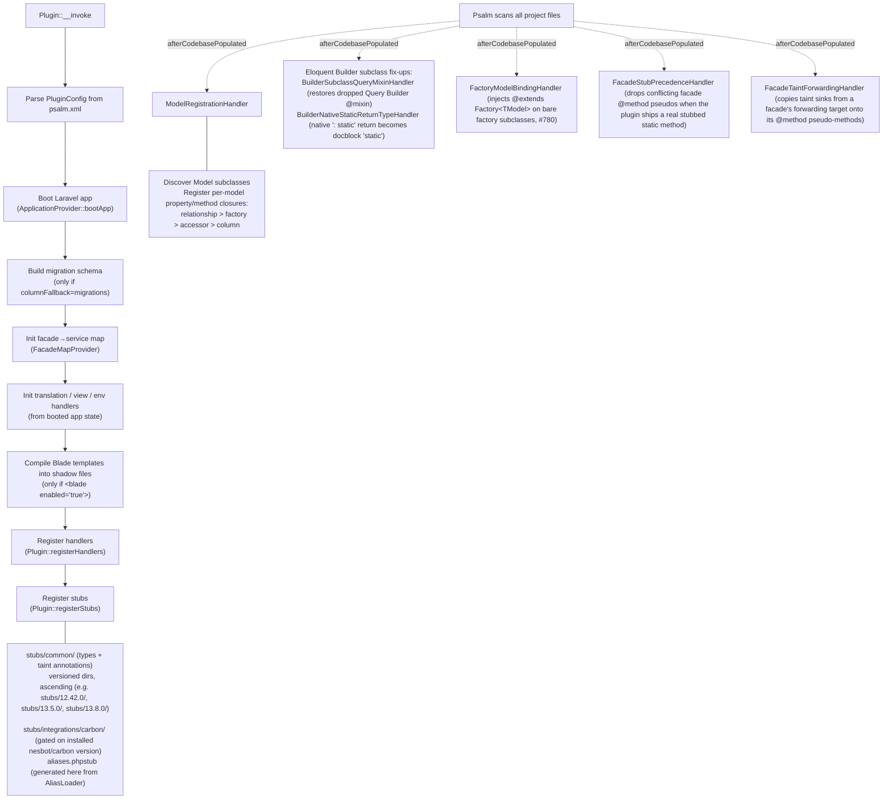
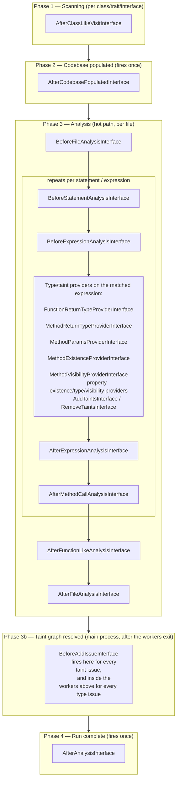

# Contributing

## How the plugin works

The plugin boots a Laravel application, then hooks into Psalm's event system to override type inference for Laravel APIs.

The app is needed at boot time to read config values (e.g. `auth.php` guards), resolve facade aliases via `AliasLoader`, and load service providers.
When run inside a Laravel project, the plugin loads the project's own `bootstrap/app.php` — so it sees the real config, routes, and providers.
When no `bootstrap/app.php` is found (e.g. analyzing a Laravel package, or running the plugin's own tests), it falls back to [Orchestra Testbench](https://github.com/orchestral/testbench) which provides a minimal Laravel app skeleton.

See `ApplicationProvider::doGetApp()` for the resolution logic.


```mermaid
flowchart TD
    A["Plugin::__invoke"] --> B["Parse PluginConfig from psalm.xml"]
    B --> C["Boot Laravel app\n(ApplicationProvider::bootApp)"]
    C --> D["Build migration schema\n(only if columnFallback=migrations)"]
    D --> E["Init facade→service map\n(FacadeMapProvider)"]
    E --> F["Init translation / view / env handlers\n(from booted app state)"]
    F --> BL["Compile Blade templates into shadow files\n(only if &lt;blade enabled='true'&gt;)"]
    BL --> G["Register handlers\n(Plugin::registerHandlers)"]
    G --> H["Register stubs\n(Plugin::registerStubs)"]

    H --- stubs["
        stubs/common/ (types + taint annotations)
        versioned dirs, ascending (e.g. stubs/12.42.0/, stubs/13.5.0/, stubs/13.8.0/)
        stubs/integrations/carbon/ (gated on installed nesbot/carbon version)
        aliases.phpstub (generated here from AliasLoader)
    "]

    I["Psalm scans all project files"] -.->|afterCodebasePopulated| J["ModelRegistrationHandler"]
    I -.->|afterCodebasePopulated| K["Eloquent Builder subclass fix-ups:\nBuilderSubclassQueryMixinHandler (restores dropped Query Builder @mixin)\nBuilderNativeStaticReturnTypeHandler (native ': static' return becomes docblock 'static')"]
    I -.->|afterCodebasePopulated| FMB["FactoryModelBindingHandler (injects @extends Factory&lt;TModel&gt; on bare factory subclasses, #780)"]
    I -.->|afterCodebasePopulated| FSP["FacadeStubPrecedenceHandler (drops conflicting facade @method pseudos when the plugin ships a real stubbed static method)"]
    I -.->|afterCodebasePopulated| FTF["FacadeTaintForwardingHandler (copies taint sinks from a facade's forwarding target onto its @method pseudo-methods)"]
    J --- models["
        Discover Model subclasses
        Register per-model property/method closures:
        relationship > factory > accessor > column
    "]
```

The whole `__invoke` body is wrapped in a try/catch: on any internal error the plugin reports a warning and disables itself for the run (or rethrows when `failOnInternalError` is set). See `src/Internal/InternalErrorReporter.php`.

Bootstrap failures are a special case: `ApplicationProvider` swallows a `bootstrap()` throw to keep the run alive (one bad `config/*.php` must not disable the plugin), so they never reach the try/catch above. `Plugin::__invoke` checks `ApplicationProvider::getBootstrapError()` right after boot and routes it through `InternalErrorReporter::reportDegradedBoot()`: a "degraded mode" warning by default, or escalation to the regular internal-error path when `failOnInternalError` is set (issue #1096). Note that Psalm's `--no-progress` flag installs a `VoidProgress`, which silences all `Progress::warning()` output, including these.

### Blade shadow files

Behind [`<blade enabled="true" />`](../config.md#blade), `Plugin::initBladeAnalysis()` compiles every `*.blade.php` file under the booted app's view paths into a PHP shadow file (`src/Blade/`) and registers the result with the run. It is synchronous inside `__invoke` on purpose: a file can only still join the analysis while `Config::initializePlugins()` is on the stack, which Psalm calls after queueing the project files and before scanning them.

The registrations, deliberately asymmetric (`Blade\PsalmShadowRegistrar`):

- the **shadow** is added via `Codebase::addFilesToAnalyze()`, which both deep-scans and analyzes it. It must stay out of `ProjectAnalyzer`'s project-file list: `TaintFlowGraph` drops a flow whose source sits in a reportable file that suppresses `TaintedInput`, and Psalm's own `addFilesToShowResults()` is redundant here because `Analyzer::addFilesToAnalyze()` already writes the same map.
- the **template** is written into `ProjectAnalyzer::$project_files` by reflection (`Blade\ProjectFileInjector`), because that private list is built from psalm.xml before plugins initialize and is all `canReportIssues()` reads. Without the write, nothing found in a template can ever be reported. The template is never queued for analysis: it is not PHP.
- the **ambient prelude classes** (`\Illuminate\View\Factory`, `ComponentAttributeBag`, `ComponentSlot`, `Component`, `Support\ViewErrorBag`) are queued via `Codebase::queueClassLikeForScanning()`. Every shadow declares them as stacked one-line `@var` docblocks, and PhpParser attaches every stacked comment to one node's comment list, so `Node::getDocComment()` — all Psalm's scanner reads to queue docblock classes — returns only the last one. The last declared entry is `$loop`, an object shape naming no class, so left unqueued, all five ambient FQCNs report `UndefinedDocblockClass` the first time nothing else in the project names them in code position (#1494).
- **string-literal class candidates** (`Blade\ClassLiteralCollector`) are queued via `ShadowRegistrar::queueResolvableClassLikesForScanning()`. A vendor directive can compile a class name into a PHP string argument (`app('Vendor\Package\Class')::method()`) instead of code position or a docblock, which neither Psalm's scanner nor the ambient queue above ever sees. `BladeBootstrapper` reads every shadow off disk (not the fresh `ShadowResult`, which does not exist on a warm-manifest run) after both other registrations, tokenizes it (`T_CONSTANT_ENCAPSED_STRING` only, so docblocks and interpolated strings are excluded), and hands the candidates to the Psalm-side adapter, which gates each one on `Config::getComposerFilePathForClassLike()` or an already-declared `class_exists($n, false)`-family check before queueing it with `store_failure=false` — most string literals name no class at all, so nothing is queued unconditionally here, unlike the ambient list (#1505).
- **runtime helper files** are queued whole via `ShadowRegistrar::queueFilesForScanning()` → `Codebase\Scanner::addFileToDeepScan()`, from the list `ApplicationProvider::runtimeDeclaredFunctionFiles()` captured around the boot. A package-style monorepo `include`s its helper file from a provider's `register()`, so nothing in the project references it and Psalm would give it no `FileStorage` at all. This is one half of the #1551 fix; the other is `Blade\RuntimeHelperVisibility` below, and neither works alone.

Both halves degrade rather than throw. Every cause (no `blade.compiler` binding, no view finder, an unwritable cache directory, a Psalm internal that moved) turns the feature off for that run with one warning; per-template compile failures are collected into a single warning with `--debug` detail. `BladeBootstrapper` holds no static state, so it needs no entry in `resetInvocationState()`.

Degradation is all-or-nothing, which decides both the ordering inside `run()` and the handler gates (#1518). The compile pass BUFFERS its template facts on the bootstrapper instead of writing them to the registries as it goes, and `publishTemplateFacts()` replays them only once the run has activated; the fallible registrar calls (`markTemplatesReportable()`, both scanner queues) all precede `registerShadowsForAnalysis()`, the one irreversible step, and `ShadowRegistry` is filled in a `finally` around it, because remap entries only RELOCATE issues while the other two registries CREATE them. `boot()` returns whether shadows actually joined the analysis, `initBladeAnalysis()` passes that back to `__invoke()`, and every Blade handler registers on that flag — NOT on `bladeEnabled` — so a degraded boot leaves nothing half-active and `UnusedViewHandler` does not walk every project file for a feature that turned itself off.

One consequence worth knowing when touching either registry: a view name is always an array KEY, and PHP casts a numeric-string key to an int, so `123.blade.php` reaches a `string`-typed consumer as `int(123)` under `strict_types`. `ViewReferenceCollector` casts on the way out, and a manifest written before that cast is caught by `ShadowManifest::normalizeViewNames()`, which drops the whole entry rather than hand a non-string name on, paying one recompile instead of replaying ints. `unusedTemplates()` still returns `array<array-key, string>`, because no cast can put a string key back — the consumer casts.

The `ProjectFileInjector` guards (`property_exists`, `is_array`, `catch (Throwable)`, and no `setAccessible()`, which is a no-op since PHP 8.1 and whose deprecation Psalm's error handler promotes to an exception) are what keep a Psalm rename from crashing a run. Re-probe them on each Psalm release, not just each major.

#### Giving a shadow the booted app's function table

Psalm keeps no global function table for ordinary project code: `Functions::functionExists()` answers from the ROOT file's `FileStorage::$declaring_function_ids`, which a file gains entries in only by `require`ing the declaring file, transitively (`Populator`'s `required_file_paths` walk). A scanned `function` becomes globally visible only under `allFunctionsGlobal`, `register_stub_files`, or `register_autoload_files`. A shadow requires nothing and usually names no class, so it reached nothing (#1551).

`Blade\RuntimeHelperVisibility` (`AfterCodebasePopulatedInterface`, registered from `registerHandlers()` on the same `$bladeActive` gate as the remap; `init()` runs in `initBladeAnalysis()`, where the capture is in scope) merges those files' `declaring_function_ids` and `declaring_constants` into every path `ShadowRegistry::shadowPaths()` knows. Constraints worth keeping:

- `+=`, never a replace. A shadow's own entries must win, and `Functions::getStorage()` throws `UnexpectedValueException` rather than declining when a declaring path does not carry the id — so a bad overwrite is a crash, not a false positive. For the same reason an id is only merged when the helper's own `FileStorage::$functions` holds it, and a constant only when `$constants` does.
- Shadows only. Merging into an ordinary project `FileStorage` would suppress genuine `UndefinedFunction` across the codebase.
- Anything `Functions::hasStubbedFunction()` already answers is skipped, so a user helper can never outrank a stub's types, and the capture excludes `vendor/` outright.
- `AfterCodebasePopulated`, not earlier: `FileStorageCacheProvider::writeToCache()` runs during scanning, so a merge before that point would persist into the on-disk file-storage cache and leak into runs with Blade off. It runs in the parent before `analyzeFiles()` forks, so workers inherit the mutation by copy-on-write.
- A degraded boot captures nothing and the whole thing no-ops, same as every other Blade half.

#### Remapping a shadow issue onto its template

Neither registration makes a finding visible by itself: an issue Psalm raises in a shadow is located in a file that is deliberately unreportable, so it dies in the reportability gate. `Blade\BladeIssueRemapHandler` (`BeforeAddIssueInterface`, registered from `registerHandlers()` only when the compile step activated) is the only channel from shadow analysis to user-visible output.

- `Blade\ShadowRegistry` maps shadow path to template path, line map and per-template-line suppressions. `BladeBootstrapper` fills it for every shadow it registers, including templates fresh enough to skip recompiling (those facts come off the manifest). It is static because Psalm instantiates event handlers itself, so it is reset in `Plugin::resetInvocationState()`.
- On a registry hit the handler rebuilds the issue on the `.blade.php` path (`Blade\ShadowIssueRelocator`), re-emits it through `IssueBuffer::accepts()`, and returns `false` to kill the shadow-path original. `BeforeAddIssue` is the only hook that can do this: Psalm dispatches it before both the reportability gate and `IssueBuffer::isSuppressed()`.
- The rebuild walks the constructor reflectively. 95 of Psalm 6's 313 concrete issue classes declare a required third parameter, so `new $class($message, $location)` throws for them, and inside an event handler that is a finding lost without a trace. A parameter that cannot be resolved declines with `null` (Psalm keeps the shadow-path original, invisible but not swallowed) rather than dropping the issue.
- `accepts()` is handed the suppressions recorded for the mapped template line, which is what makes `{{-- @psalm-suppress X --}}` work: the event carries the issue but not the suppressed-issue list Psalm was about to check it against. An `<issueHandlers>` suppression scoped to the view directory needs nothing extra, because `accepts()` consults `Config::reportIssueInFile()` on the new path itself.
- A shadow line that maps to no template line (the prelude) is re-emitted on line 1 with an ` (unmapped)` suffix. `Mixed*` issues are dropped instead, because the prelude types every unresolved template variable as `mixed` and those findings say nothing about the template.
- Under a taint flow graph the handler declines every non-`Tainted*` issue: Psalm 6 runs taint exclusively and `IssueBuffer::add()` discards them anyway.
- A `TaintedInput` carries two further constructor arguments describing how the taint travelled, and both are remapped by `Blade\JourneyRemapper` before the rebuild. The journey ARRAY holds the source chain, each step repositioned onto the template its shadow came from; the journey TEXT also spells out the sink-side hops the array stops short of, so it is rewritten by substituting `file:line:column` descriptors rather than regenerated. A journey crosses files, so the remap resolves a shadow per step (and for the issue's own path) instead of reusing one; steps in ordinary application code are left untouched. A shadow step whose template has no such line declines the whole issue with `null` — a half-remapped journey is worse than none.

#### Validating a call site against a template contract

Behind [`<blade validateViewData="true" />`](../config.md#validateviewdata), `Handlers\Views\ViewContractHandler` (`AfterStatementAnalysisInterface`) reports a declared template variable the call site never passes (`MissingViewVariable`) or one whose value does not satisfy the declared type (`InvalidViewVariableType`). The class is registered from `registerHandlers()` under `bladeActive && (bladeValidateViewData || bladeReportUnusedViewData)` and carries one independent bool per rule, so the two opt-ins share a single walk of the statement; `init()` sets both and `afterStatementAnalysis()` bails only when neither is on.

- `Blade\ContractParser::parseDeclarations()` reads the `{{-- @var --}}` and `@props([...])` declarations from the template source. It is a SIDE CHANNEL: the declarations are deliberately NOT fed into `ShadowCompiler::compile()`, because contract types in the prelude change every shadow's content and its fingerprint. Typing the template body is a separate decision.
- `Blade\ContractRegistry` maps view NAME to contract. `BladeBootstrapper::compileAll()` derives it from the template path relative to its view root (first root winning as `FileViewFinder` does) but only BUFFERS it; the registry is filled by `publishTemplateFacts()` after activation, in insertion order, so the first-root precedence still lives in `register()`. Static for the same reason as `ShadowRegistry`, so it is reset in `Plugin::resetInvocationState()`.
- The contract is persisted as the manifest's sixth slot, so a template fresh enough to skip recompiling still has one. `ShadowManifest::normalizeEntries()` drops any entry that is not eight slots wide, and `normalizeContract()` drops any contract that is not four wide, which self-evicts everything written by an earlier shape at the cost of one recompile.
- `Handlers\Views\ViewCallChain` walks the rendering expression from the OUTERMOST call inwards, collecting the view name and every data contribution in one pass. Outermost-first is the whole point: expression analysis is post-order, so a hook on the inner `view('greeting')` of a `view('greeting')->with('name', $n)` chain would report every declared variable as missing. It refuses on any link it does not model, and `MissingViewVariable` additionally needs the supplied key set to be provably closed.

#### Reporting an unused template

Behind [`<blade reportUnusedViews="true" />`](../config.md#reportunusedviews), `Handlers\Views\UnusedViewHandler` (`AfterCodebasePopulatedInterface`, registered from `registerHandlers()` under `bladeActive && bladeReportUnusedViews`) reports a template ([UnusedView](../issues/UnusedView.md)) that no statically-provable reference ever names.

Collection cannot happen during analysis: Psalm 6 forks analysis workers and plugin statics never return from a fork (`Internal/Codebase/Analyzer.php`). Collection therefore splits across two phases that both run in the parent process, before that fork:

- **Template-side, at compile time.** `Blade\ViewReferenceCollector::collectFromSource()` walks each compiled shadow right after `ShadowCompiler::compile()` succeeds, reading the `$__env->make()` / `->first()` calls that `@include` / `@extends` / `@includeFirst` compile to. The result is persisted as the manifest's seventh slot (`Blade\ShadowManifest::store()`/`referencesFor()`), so a template fresh enough to skip recompiling still contributes its references.
- **Call-site, at `AfterCodebasePopulated`.** `UnusedViewHandler` walks every project file's statements (`Codebase::getStatementsForFile()`, reusing Psalm's parser cache) with the same collector's `collect()`, reading the `view()` helper and the static `View::make()` form.
- Every discovered template is claimed by `BladeBootstrapper::registerContract()` (the same call site that buffers its `ContractRegistry` entry, first root wins the same way) and reaches `Blade\ViewReferenceRegistry` with the rest of the buffered facts, including templates that failed to compile — `BladeBootstrapper::run()` now marks EVERY discovered template reportable, not just the ones with a shadow, or an uncompiled template's `UnusedView` would die in `ProjectAnalyzer::canReportIssues()`.
- One reference either phase cannot resolve statically (`Blade\ViewReferenceCollector` returns `dynamic: true`) turns the whole check off for the run, with one `Progress::warning()`: a lower bound on "used" cannot prove a template unused. Only the compiled-shadow phase treats an unresolved `$__env->make()`/`->first()` argument as a dynamic reference — a plain project file's arbitrary `$obj->make($x)` is not scanned at all, so it can only ever add a false "used", never disable the rule (see the class docblock for the asymmetry).
- Emission reuses the shadow-remap machinery without a shadow: `Blade\TemplateLocation::atLine()` (extracted from `Blade\ShadowTarget`) builds a `CodeLocation\Raw` straight from the template source and `Blade\ShadowRegistry::templateSource()`, so a template with no compiled shadow can still be reported at line 1.

#### Reporting an unread data key

Behind [`<blade reportUnusedViewData="true" />`](../config.md#reportunusedviewdata), the same `ViewContractHandler` reports a data key ([UnusedViewData](../issues/UnusedViewData.md)) the resolved template neither reads nor declares.

- The read set comes from `ContractParser::parseDataContract()`, which is `parseDeclarations()` plus a walk of the COMPILED output. It is the same side channel: the contract is built after `ShadowCompiler::compile()` returns and never reaches it. One shared `walkReads()` feeds both consumers — `TemplateContract`'s set drops loop aliases, this one keeps them, because the question here is "does the template use this name at all".
- `readsUnknown` is load-bearing. A parse failure, a `$$name`, an `extract()`, or a `compact()` with a non-literal argument makes the set a lower bound, and a lower bound cannot prove a key unused. `get_defined_vars()` is deliberately NOT in that list: Blade compiles it into every `@include`, so treating it as unknown would disable the rule almost everywhere. `@props` and `@aware` compile to `$$name` writes, which is why component templates decline.
- `ViewReferenceCollector::collectDataIncludes()` collects the manifest's eighth slot: the subset of a template's references that inherit its whole scope. Membership is decided by the DATA argument, not the directive — every scope-passing directive compiles it to `array_diff_key(get_defined_vars(), ['__data' => 1, '__path' => 1])`, whose position shifts with the directive's own optional data array, so the whole argument list is scanned for that shape. `@includeIsolated` and `@each` compile to the same `$__env->` methods but pass no parent scope and are excluded by that gate alone.
- `Blade\ReadSetResolver` closes each template's reads UNION its declared contract vars over that graph, recursively, with a by-reference visited set (a revisit contributes nothing, which is correct for a union and terminates on a cycle). It declines on the first template in the chain whose reads are unknown, whose data-includes hold a dynamic name, or that `ContractRegistry` never claimed.
- `ShadowManifest::isFresh()` takes an `int-mask-of<ShadowManifest::SLOT_*>`: a slot whose collection pass was off when the entry was written is a null, and requiring it forces one recompile on flag flip rather than leaving every template permanently "fresh with nothing collected".
- Emission re-checks `PreludeBuilder::BLADE_OWNED_NAMES` on the PASSED side, because the read-set extraction strips those names as Blade's own — deliberately the full six-name set (`__env`, `errors`, `loop`, `attributes`, `slot`, `component`), not `AMBIENT_TYPES` (the three names the prelude ALWAYS types): a call site passing `'slot'` is never wrong about the template, even for a template where `attributes`/`slot` are typed conditionally or `component` is never typed at all (#1525). It is deliberately not gated on `ViewCallChain::$complete`: an open key set means there may be more keys, not that the ones in hand were not passed.

Everything in the pipeline that reads a Psalm internal whose shape differs between Psalm 6 and Psalm 7 goes through `Blade\PsalmBridge` (taint-run detection, `TaintedInput` detection, journey step shape, journey-text descriptor format), each method carrying the Psalm 6 `file:line` it was read off. Porting the Blade pipeline to the `4.x` line is a rewrite of that one file.

#### Annotating a template from its call sites

`psalm-laravel blade:annotate` ([user docs](../blade.md#annotating-templates)) is the one path on which this plugin writes to the analysed source tree. It is a two-half pass inside an ordinary analysis, registered from `Plugin::registerHandlers()`.

- The gate is `Blade\Annotate\AnnotateRequest::fromEnvironment()`: a control file the CLI put in the child process's environment, carrying the `psalm-laravel-annotate` marker key, on a regular on-disk file (a `data://` URL would otherwise satisfy the marker with no file at all). The marker is what makes the variable safe to leak — a stale shell or a `.envrc` pointing it at any other readable JSON (a `composer.json`, say) would otherwise arm the codemod AND have `publish()` overwrite that file. It is re-checked inside `publish()` AND in `AnnotationWriter::run()` before the first template is written, because the path is named by an environment variable and can be repointed mid-run. No config flag turns the write on, so a plain `vendor/bin/psalm` run cannot reach it even with Blade fully configured; conversely a valid request force-enables Blade for a project that has it off, which is the command's explicit purpose. Annotate mode also forces the `collectDataIncludes` half of the compile pass on, because the read set is what it annotates from.
- `Cli\AnnotateCommand` runs `vendor/bin/psalm` through `proc_open` (the `AnalyzeCommand` shape) and forces `--threads=1`, stripping any `--threads` the caller passed rather than appending a duplicate, which PHP's `getopt` would hand Psalm as an array. Single-threaded is not a preference: statics collected in a forked analysis worker never reach the parent, and the parent is where `AfterAnalysis` runs. Measured on a scratch project, `--threads=4` reaches the writer with **zero** collected call sites. The plugin half does not trust the command for this: `AnnotationCollector::sawAnalysis()` is false in the parent of a forked run, and `AnnotationWriter::run()` then publishes an error instead of writing `mixed` over the whole view tree.
- `Blade\Annotate\AnnotationCollector` (`AfterStatementAnalysis`) records producer types through the same `ViewCallChain::from()` walk `ViewContractHandler` checks call sites with. It answers a type only when every producer of that view agreed on `Union::getId(false)` AND no producer left the data set open — an open set can carry the same key with another type invisibly — and only when the id survives a `Type::parseString()` round trip, carries no template parameter at any depth (a `TypeVisitor` walk — `Union::hasTemplate()` is false for `Collection<int, T>`), and cannot close the Blade comment it is written into.
- `Blade\Annotate\AnnotationWriter` (`AfterAnalysis`) joins `ViewReferenceRegistry::templates()` (paths, published unconditionally) with `ContractRegistry::contractFor()` (declarations and read set), plans per template FILE rather than per view name (a published override is claimed under two names and would otherwise be reported twice), and splices with `Blade\Annotate\TemplateAnnotator`. Insertion only: idempotency comes from re-reading the declarations out of the source, not from a marker, and `TemplateAnnotator` reads them with `ContractParser::VAR_PATTERN` itself, the raw `<?php /** @var */ ?>` spelling (which the contract parser does not read) included by way of the shared `ContractParser::IDENTIFIER` name grammar. A pattern of its own that bound a different name would append a duplicate declaration on every run: `\w` binds `$caf` out of `$café`.
- `ViewDataContract::$loopVariables` exists for this pass alone. The read set deliberately KEEPS `@foreach` aliases (UnusedViewData asks whether a name is used at all), but declaring one reports `MissingViewVariable` at every correct call site, so the writer subtracts them. They ride the fifth contract slot of the shadow manifest; an entry written with the old four is dropped by `normalizeContract()` and recompiled.

#### Debugging a shadow

Shadows live under the `cacheDir` resolved by `PluginConfig::resolveBladeCacheDir()` (default: `blade/` inside the [plugin cache directory](../config.md#cache-directory)). Each source generation gets a file named `sha1($templatePath) . '-' . $fingerprint . '.php'` (`ShadowManifest::shadowPath()`), alongside a single `manifest.php` that records, per shadow, the template path, line map, extends line, source fingerprint, inline suppressions, and the template contract. Delete the whole `cacheDir` to force every template to recompile. `--clear-cache` only removes `$config->getCacheDirectory()`, so it does the same for the default location, which nests under it, but not for a custom `cacheDir` set outside Psalm's own cache directory.

Pruning drops superseded manifest entries but retains their generation files because another invocation may still be reading them. Clear the cache directory when no analyses are running to reclaim those files. Deleted-template pruning retains its existing unlink behavior.

The source fingerprint hashes the template text, the marker pass version, the Laravel framework version, the plugin version, and (see `Blade\CompilerEnvironment::describe()`) the booted `BladeCompiler`'s own registration surface: custom directives, `if()` conditions, extensions, precompilers, echo handling, component maps, and a compiler subclass swap. Changing one of these invalidates every cached shadow once. What it does NOT reach: runtime state read from inside a directive's own body (`config()`, a global, a class static), and component metadata Laravel resolves live during compilation (a class component's constructor signature, an anonymous-component template that did not exist yet). Delete the `cacheDir` by hand to pick up a change like that.

To inspect a shadow, run once so the cache is warm, then find the file by hashing the template's real (absolute) path, not its project-relative path: `findTemplates()` registers each template by `SplFileInfo::getRealPath()`, and `ShadowManifest::shadowPath()` hashes that same string. For example:

```bash
php -r "echo sha1(realpath('resources/views/profile.blade.php')), \"\n\";"
```

Open the `<hash>-<fingerprint>.php` referenced by `manifest.php` in the `cacheDir` directly: it is plain PHP, with the `PreludeBuilder` output as a leading docblock block followed by the compiled Blade output.

Two flags matter when working on this pipeline:

* `--debug` on the Psalm invocation prints the individual compile failure for every skipped template; without it, `BladeBootstrapper` only aggregates them into one warning naming up to three paths.
* `--threads=1 --no-cache` when stepping through `BladeIssueRemapHandler` or `JourneyRemapper` with `var_dump()`: forked worker processes swallow output, and a warm shadow cache skips the compile path you are trying to observe.

## Getting started

```bash
git clone git@github.com:psalm/psalm-plugin-laravel.git
cd psalm-plugin-laravel
composer install
composer test        # lint + psalm + unit + type tests
```

## Running tests

```bash
composer test          # full suite (lint + psalm + unit + type)
composer test:unit     # PHPUnit unit tests only
composer test:type     # type tests only (psalm-tester)
composer psalm         # self-analysis of plugin source
composer test:app      # creates a fresh Laravel project, scaffolds common class types (`make:xxx`), installs the plugin, and runs Psalm on the result
LARAVEL_INSTALLER_VERSION=12.12.2 composer test:app # run over a specific Laravel version

# single test file
./vendor/bin/phpunit tests/Unit/PluginConfigTest.php
./vendor/bin/phpunit --filter=AuthTest tests/Type/
```

## Code style

- PER Coding Style 3.0 (powered by php-cs-fixer: run `composer cs` to apply fixes)
- Explain decisions and ideas in comments

```bash
composer cs     # auto-fix style issues
composer rector # run rector refactoring
```

## How to add a stub

Stubs override Laravel's type signatures. Place them in:

- `stubs/common/` — shared across Laravel versions (includes both type stubs and taint annotations)
- `stubs/<version>/` — version-specific overrides, loaded when the installed Laravel is `>=` the dir name (`version_compare`). Both major-only (`stubs/13/`) and patch-level (`stubs/13.8.0/`) names work; currently `stubs/12.42.0/`, `stubs/13/`, `stubs/13.5.0/`, and `stubs/13.8.0/` exist
- `stubs/integrations/<package>/` — optional stubs for third-party packages, gated on the package being installed (`carbon/`, with a `pre-3.12/` subdir loaded only for older Carbon, see `src/Stubs/CarbonStubProvider.php`; and `laravel-ai/`, see below)

Rules:
- Verify signatures against actual Laravel code (not against Laravel PHPDoc or method signatures)
- Add a type test in `tests/Type/tests/` to prevent regression
- For taint annotations, see [Taint Analysis Stubs](taint-analysis.md)

### The `laravel/ai` integration gate

Four things load together for `laravel/ai`, all behind `Plugin::laravelAiIntegrationEnabled()` (the shared `LaravelAiIntegration::isEnabled()` check for `>=0.11.0 <1.0.0`), and they must stay in lockstep:

1. `stubs/integrations/laravel-ai/` via `Plugin::optionalIntegrationStubs()`.
2. `Handlers\Ai\LlmOutputTaintHandler` via `Plugin::registerHandlers()`.
3. `Handlers\Ai\PromptGuardTaintHandler` via `Plugin::registerHandlers()`, which exempts a `prompt()` / `stream()` call site whose agent middleware declares a guard annotated `@psalm-taint-escape llm_prompt` on whichever method `Illuminate\Pipeline\Pipeline` dispatches to it (`__invoke` for an object entry that has one, `handle` otherwise). Emission-time only (`BeforeAddIssueInterface`), stateless, so it needs no `resetInvocationState()` entry.
4. `Internal\PromptInjectionIssuePolicy` via `Plugin::__invoke()`, which preserves Psalm's normal `TaintedLlmPrompt` error by default and applies a narrow D-in suppression only for `<findPromptInjection value="false" />`.

Part of that set is a silent half-integration: stubs without the handlers lose the property sources and the guard exemption, and the issue policy without the stubs could suppress a project's own `llm_prompt` annotations. Adding a fifth site means adding it to that method's callers, not writing a fifth copy of the version check.

Stub-versus-vendor drift is invisible to Psalm here (a registered stub wins over the reflected class), so `bin/ci/check-laravel-ai-stub-parity.php` diffs the two directly in CI, and `tests/Unit/Ci/LaravelAiStubParityCheckerTest.php` pins that script's own checks. A stub method added after the `>=0.11.0` floor gets tagged `@since X.Y.Z`; the checker reads that tag and exempts the method for an older installed release instead of reporting it as drift.

### Stub merging: how Psalm combines annotations

When **multiple stub files declare the same method on the same class**, Psalm reuses a single MethodStorage object and re-applies docblock parsing. The merging rules differ by annotation kind:

- **Type annotations** (`@return`, `@param`): last-loaded file wins (direct assignment `=`)
- **Taint annotations** (`@psalm-taint-*`): all files accumulate (bitwise OR `|=`)

This means splitting type and taint annotations for the same method across two stub files is fragile -- the type that "wins" depends on file loading order. Always put both in the same file.

When a **class stub and a trait stub** both declare the same method, Psalm creates **separate** MethodStorage objects -- one per class/trait. There is no cross-merging: if `Connection.phpstub` overrides a method defined in `ManagesTransactions.phpstub`, the trait's annotations (including taints) are ignored for that method. To keep both type and taint annotations, put them on the class stub.

Registration order (`Plugin::registerStubs()`): all `common` files, then version dirs ascending (`array_merge`). Since type annotations are last-loaded-wins, this order (not alphabetical path) decides overrides.

### Version-specific overrides (conditional stub loading)

A file in a version dir (`stubs/13.16.0/...`, loaded when installed Laravel `>=` that version) overrides the same-named `common` file **per method**. Multiple version dirs cascade ascending: per method, the highest dir `<=` the installed version wins; a method it doesn't redeclare falls through to lower dirs, then `common`. (Verified: with `common` + `12.6.0` + `12.8.0` all declaring `MessageBag::has`, `12.8.0` won; `missing()` declared only in `12.6.0` survived; `isEmpty()` came from `common`.)

Authoring an override:

- Declare only the changed methods; the rest merge from `common`.
- Copy the full class header (`extends`/`implements` + `use`) verbatim, because a class re-declaration resets Psalm's interface list and silently strips contracts (see stub-authoring rules).
- Types replace, taints accumulate (OR), so keep both for a method in one file.

**Common vs version dir.** Return narrowing that holds across all versions (Laravel only improved its annotation) goes in `common`. A parameter widened by behavior present only in a newer Laravel (e.g. `firstOrNew`'s `values` taking `\Closure|array` only on 13) must go in the version dir: widening `common` would tell Psalm a call is valid that fatals at runtime on older versions (silent false negative).

### Testing version-specific stubs

A type test that asserts a `stubs/<version>/` override would fail on the lower cells of the CI matrix (`.github/workflows/tests.yml` runs `test:type` over Laravel `^13.3`, `^12.14` and `^11.35`), because the override does not load on the older Laravel. Gate such a test with a `--SKIPIF--` section so it runs only where the stub applies:

```
--SKIPIF--
<?php
require getcwd() . '/vendor/autoload.php';
\Tests\Psalm\LaravelPlugin\Type\LaravelVersion::skipBelow('12.42.0');
--FILE--
... assertion of the version-specific behavior ...
```

`LaravelVersion::skipBelow($version)` skips when the installed Laravel is older than the stub dir (`skipFrom($version)` does the reverse for behavior only on older lines). The `--SKIPIF--` script runs in a bare process from the project root, so it requires the autoloader via `getcwd()`. See `tests/Type/tests/Http/PendingRequestTest.phpt` for a worked example (the async HTTP client types are 12.42+).

## How to add a handler

Handlers implement Psalm event interfaces to override type inference.
Create the handler class in the appropriate `src/Handlers/` subdirectory, then register it in `Plugin::registerHandlers()`.
`CollectionGroupByKeyByHandler` specializes literal model attributes for collection `groupBy()` and `keyBy()` calls; unsupported forms defer to Laravel's stubs.
Most taint handlers live under the Laravel feature directory whose API they cover (e.g. `Handlers/Eloquent/WhereColumnTaintHandler`); a stop-gap for an upstream Psalm bug that applies to every call site regardless of Laravel domain goes in `Handlers/Taint/` instead (e.g. `NamedArgumentTaintHandler`, vimeo/psalm#11923).

### Experimental issue lifecycle

Experimental status changes an issue's default severity, never whether its handler or type inference runs. Keep the experimental policy list in `ExperimentalIssuePolicy` as the single source of truth; `PromptInjectionIssuePolicy` is a separate, integration-gated opt-out for the stable `TaintedLlmPrompt` issue. Both policies delegate to `Internal\DefaultIssueLevels`, which implements the safe setter Psalm lacks: it applies a default only when the project has no handler for that issue, and recognizes its own earlier default by object identity so a later invocation can refresh it when the flag flips. Any explicit issue handler owns the complete reporting policy, including its base level and scoped filters.

1. Introduce an experimental issue: register its handler normally, add its issue type to that internal list, and let the policy default it to `info` (or `error` when `<experimental value="true" />` is configured).
2. Graduate an issue: remove it from the internal list; it becomes a normal stable error.
3. Withdraw an issue: remove its handler and issue class.

Do not add user-facing feature names or handler-registration gates. Do not overwrite or merge explicit issue handlers.

### Psalm hooks used by the plugin

Psalm processes code in phases. Each hook fires at a specific phase and has different data available.
Analysis hooks are hot paths — they fire on every matching expression. Scanning hooks fire once per class or once total.
Source of truth for which handler implements which hook: `Plugin::registerHandlers()` plus each handler's `implements` clause.


```mermaid
flowchart TD
    subgraph P1["Phase 1 — Scanning (per class/trait/interface)"]
        A1["AfterClassLikeVisitInterface"]
    end

    subgraph P2["Phase 2 — Codebase populated (fires once)"]
        B1["AfterCodebasePopulatedInterface"]
    end

    subgraph P3["Phase 3 — Analysis (hot path, per file)"]
        direction TB
        C1["BeforeFileAnalysisInterface"] --> C2

        subgraph LOOP["repeats per statement / expression"]
            direction TB
            C2["BeforeStatementAnalysisInterface"] --> C3["BeforeExpressionAnalysisInterface"]
            C3 --> C4["Type/taint providers on the matched expression:
            FunctionReturnTypeProviderInterface
            MethodReturnTypeProviderInterface
            MethodParamsProviderInterface
            MethodExistenceProviderInterface
            MethodVisibilityProviderInterface
            property existence/type/visibility providers
            AddTaintsInterface / RemoveTaintsInterface"]
            C4 --> C5["AfterExpressionAnalysisInterface"]
            C5 --> C6["AfterMethodCallAnalysisInterface"]
        end

        C6 --> C7["AfterFunctionLikeAnalysisInterface"]
        C7 --> C8["AfterFileAnalysisInterface"]
    end

    subgraph P3B["Phase 3b — Taint graph resolved (main process, after the workers exit)"]
        E1["BeforeAddIssueInterface
        fires here for every taint issue,
        and inside the workers above for every type issue"]
    end

    subgraph P4["Phase 4 — Run complete (fires once)"]
        D1["AfterAnalysisInterface"]
    end

    P1 --> P2 --> P3 --> P3B --> P4
```

### Registering handlers

There are two ways to register:

1. **Class-level** (most handlers): implement the interface, register via `$registration->registerHooksFromClass(MyHandler::class)` in `Plugin::registerHandlers()`
2. **Closure-level** (model property handlers): register via `$providers->property_type_provider->registerClosure(...)` — used by `ModelRegistrationHandler` to bind property handlers per-model after codebase is populated

Every class registration keeps the matching `require_once` beside
`registerHooksFromClass()`.

#### Exempting one call site from a stub's taint sink

Narrow the finding at emission time, not in the taint graph.
`ResponseFactoryTaintHandler` is the reference shape: it implements only
`BeforeAddIssueInterface`, matches the issue's journey tail against the sink's
labels, re-checks the call site, and returns `false` to drop the finding. Graph
level removal (`RemoveTaintsInterface`) cannot express "this call site only" and
leaks onto shared flow edges; [Architecture Decisions](decisions.md) records why,
along with the alternatives already ruled out.

Such a handler has to be stateless, because the analysis hooks run in the worker
processes and taint issues are emitted only after those exit. Re-derive every fact
from the issue plus `Codebase::getStatementsForFile()`, which reads the parser
cache. The hook fires for every issue in the run, so bail on the issue class first
and only then do anything expensive. Every uncertain path returns `null` and keeps
the finding.

See [Architecture Decisions](decisions.md) for design rationale, [Laravel Magic Call Patterns](laravel-magic-call-patterns.md) for how Laravel's __call/__callStatic chains work, [Psalm Type Annotations](types.md) for a quick reference of all supported types and annotations, and [Debugging with Xdebug](xdebug.md) for stepping through handler code.

## External resources

- [Authoring Psalm Plugins](https://psalm.dev/docs/running_psalm/plugins/authoring_plugins/)
