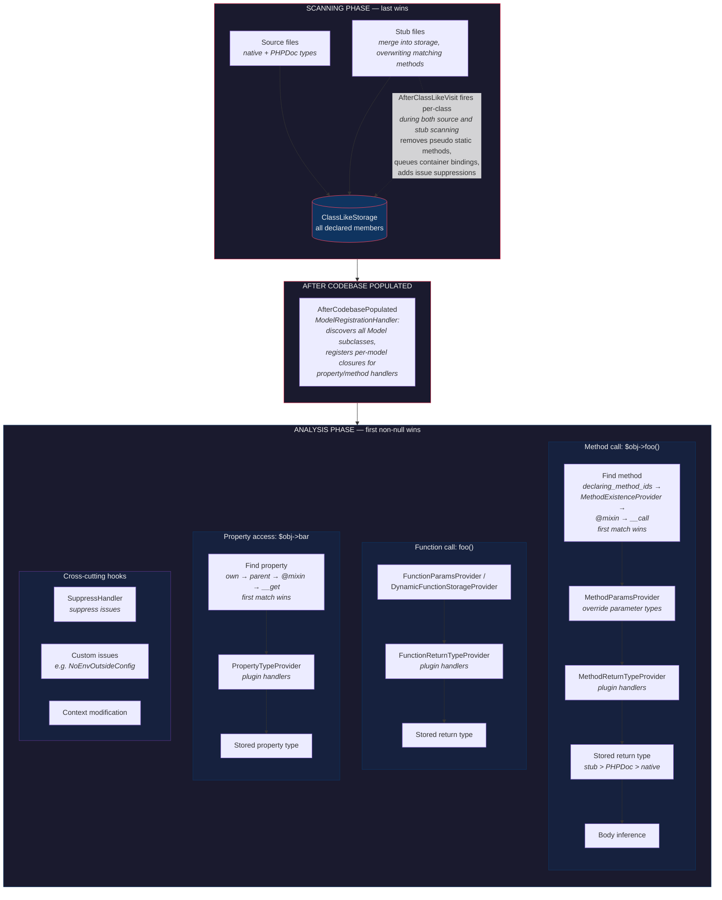

# Laravel Magic Method Patterns (`__call` / `__callStatic`)

How Laravel uses PHP's magic methods to proxy calls across layers, and the exact resolution order PHP follows.

## PHP Method Resolution Order

When you call `$obj->method()`, PHP resolves in this order:

```
1. Own methods + trait methods (traits are flattened into the class at compile time, so they behave as if declared directly on the class. Last trait wins on conflict.)
2. Inherited methods (parent classes, walking up the chain)
3. __call($name, $arguments)  <-- magic fallback
```

For static calls `Class::method()`:

```
1. Own static methods + trait static methods (same flattening)
2. Inherited static methods
3. __callStatic($name, $arguments)  <-- magic fallback
```

**Key:** `__call`/`__callStatic` only fire when the method is NOT found through steps 1-2.

**Important:** `__call` is itself a regular method — it follows the same own → parent → trait
resolution. There is only ever **one** `__call` that fires; PHP does not chain them. If both a
parent class and a trait define `__call`, the conflict must be resolved explicitly. This is why
Laravel uses the alias pattern:

```php
class Relation {
    use Macroable {
        __call as macroCall;  // rename trait's __call to avoid conflict
    }

    // Own __call — the ONLY one that fires
    public function __call($method, $params)
    {
        // Manually delegate to the trait's version for macros
        if (static::hasMacro($method)) {
            return $this->macroCall($method, $params);
        }
        // Then do its own forwarding
        return $this->forwardDecoratedCallTo($this->query, $method, $params);
    }
}

class HasMany extends Relation {
    // No own __call → inherits Relation::__call
}
```

The same pattern is used by `Relation`, `Query\Builder`, and other classes that
combine `Macroable` with custom `__call` forwarding logic. Note: `Eloquent\Builder` does NOT
use the `Macroable` trait — it has its own independent two-tier macro system (local + global).

## Laravel's Major Magic Call Patterns

### 1. Eloquent Relations → Builder (the `forwardDecoratedCallTo` pattern)

**Class:** `Illuminate\Database\Eloquent\Relations\Relation`

```php
// Relation::__call()
public function __call($method, $parameters)
{
    // 1. Check macros first
    if (static::hasMacro($method)) {
        return $this->macroCall($method, $parameters);
    }

    // 2. Forward to the underlying Eloquent Builder
    //    forwardDecoratedCallTo returns $this when the Builder returns itself
    return $this->forwardDecoratedCallTo($this->query, $method, $parameters);
}

// Exception: MorphTo overrides __call with two distinct paths:
// - On success: buffers 5 specific methods (select, selectRaw, selectSub,
//   addSelect, withoutGlobalScopes) for replay on the resolved related model
// - On BadMethodCallException: buffers the failing call unconditionally
//   (assumed to be a macro/scope on the actual related model type)
// This is the only Relation subclass with materially different __call behavior.
```

**`forwardDecoratedCallTo` behavior** (from `ForwardsCalls` trait, simplified):
```php
// Simplified — actual code validates error message against get_class($object)
// and uses named capture groups. Only "method not found" errors are rewritten;
// all other errors are rethrown as-is.
protected function forwardCallTo($object, $method, $parameters)
{
    try {
        return $object->{$method}(...$parameters);
    } catch (Error|BadMethodCallException $e) {
        // Rethrows with the CALLER's class name in the error message
        static::throwBadMethodCallException($method); // returns never
    }
}

// "Decorated" refers to the Decorator pattern — the Relation wraps (decorates) the Builder.
// When the Builder returns itself, the decorator swaps it for $this so the caller
// stays in the Relation layer instead of dropping down to the Builder.
protected function forwardDecoratedCallTo($object, $method, $parameters)
{
    $result = $this->forwardCallTo($object, $method, $parameters);

    return $result === $object ? $this : $result;
}
```

**Call chain (PHP runtime resolution, not Psalm's — Psalm uses declaring_method_ids + @mixin instead):**
```
$post->comments()->where('approved', true)
  │
  ├─ comments() returns HasMany (a Relation)
  │
  └─ where() on HasMany:
       1. Not declared on HasMany          ✗
       2. Not declared on HasOneOrMany     ✗
       3. Not declared on Relation         ✗
       4. __call fires →
          forwardDecoratedCallTo($this->query, 'where', [...])
            → Builder::where() returns Builder
            → $result === $object? yes → return $this (the HasMany)
       Result: HasMany (not Builder)
```

**Psalm challenge:** Psalm resolves `where()` via `@mixin Builder` on Relation. The resolved method returns `Builder`, not the Relation. The plugin solves this with `MethodForwardingHandler` using `interceptMixin=true`: the handler registers for Builder (the mixin target), detects when the original caller was a Relation, and returns the concrete Relation type with template params instead. For methods declared in Relation stubs, Psalm finds them in `declaring_method_ids` before reaching the mixin.


### 2. Eloquent Builder → Query Builder

**Class:** `Illuminate\Database\Eloquent\Builder`

Note: `Eloquent\Builder` does NOT use the `Macroable` trait. It has its own independent
two-tier macro system (local instance macros + global static macros) with inline execution.

```php
// Eloquent\Builder::__call()
public function __call($method, $parameters)
{
    // 1. Local macros (instance-level, stored in $this->localMacros)
    if ($method === 'macro') { ... }
    if ($this->hasMacro($method)) {
        // Inline execution — passes $this as FIRST positional argument (not via bindTo)
        array_unshift($parameters, $this);
        $macro = $this->localMacros[$method];
        return $macro(...$parameters);
    }

    // 2. Global macros (class-level, stored in static::$macros)
    if (static::hasGlobalMacro($method)) {
        // Also inline execution — binds Closure to $this and calls directly
        $callable = static::$macros[$method];
        if ($callable instanceof Closure) {
            $callable = $callable->bindTo($this, static::class);
        }
        return $callable(...$parameters);
    }

    // 3. Model scopes (checked AFTER macros)
    if ($this->hasNamedScope($method)) {
        return $this->callNamedScope($method, $parameters);
    }

    // 4. Passthru methods (count, exists, aggregate, etc. → delegated to base query)
    if (in_array(strtolower($method), $this->passthru)) {
        return $this->toBase()->{$method}(...$parameters);
    }

    // 5. Forward to underlying Query\Builder
    //    Uses forwardCallTo (NOT forwardDecoratedCallTo), then returns $this unconditionally
    $this->forwardCallTo($this->query, $method, $parameters);

    return $this;
}

// Eloquent\Builder::__callStatic() — handles macro/mixin registration
public static function __callStatic($method, $parameters)
{
    // 1. 'macro' → register a global macro
    // 2. 'mixin' → register methods from an object as macros
    // 3. Global macro call → execute the macro
    // 4. throw BadMethodCallException
}
```

**Call chain:**
```
User::query()->whereJsonContains('meta->tags', 'php')
  │
  └─ whereJsonContains() on Eloquent\Builder:
       1. Not declared on Eloquent\Builder  ✗
       2. Not a local/global macro          ✗
       3. Not a scope on User model         ✗
       4. Not a passthru method             ✗
       5. __call → forwardCallTo to Query\Builder (return value ignored)
          → unconditionally returns $this (the Eloquent\Builder)
       Result: Eloquent\Builder (not Query\Builder)
```


### 3. Facades → Container Resolution (`__callStatic`)

**Class:** `Illuminate\Support\Facades\Facade`

```php
// Facade::__callStatic()
public static function __callStatic($method, $args)
{
    $instance = static::getFacadeRoot();  // checks static::$resolvedInstance cache first,
                                          // then resolves from container. Cached per static::$cached.

    if (! $instance) {
        throw new RuntimeException('A facade root has not been set.');
    }

    return $instance->$method(...$args);
}
```

**Call chain:**
```
DB::table('users')
  │
  └─ table() on Illuminate\Support\Facades\DB:
       1. Not a static method on DB         ✗
       2. Not a static method on Facade     ✗
       3. __callStatic fires →
          getFacadeRoot() → resolves DatabaseManager from container
          → DatabaseManager::table('users')
       Result: Query\Builder
```

**Psalm challenge:** `__callStatic` loses taint context. The generated alias stubs (`class DB extends DatabaseManager`) help with type resolution but don't carry taint annotations. Calling the underlying class directly (`DB::connection()->...`) works correctly for taint analysis.


### 4. Model Attribute Access (`__get` / `__set`)

**Class:** `Illuminate\Database\Eloquent\Model`

```php
// Model::__get()
public function __get($key)
{
    return $this->getAttribute($key);
}

// Model::getAttribute() resolution order:
// 1. hasAttribute($key) — single check that covers:
//    - $attributes array (database columns)
//    - $casts
//    - Legacy accessor: getFirstNameAttribute()
//    - New Attribute accessor: protected function firstName(): Attribute
//    - Class castables
//    All handled inside getAttributeValue() if hasAttribute() is true.
//
// 2. method_exists(self::class, $key) — if a method with this name exists
//    on the model but isn't an attribute, return null (or throw in strict mode)
//
// 3. isRelation($key) or relationLoaded($key) — load/return the relation
//
// 4. Otherwise: return null
//    (or throw if Model::preventAccessingMissingAttributes() is enabled)
```

**Psalm challenge:** Database columns aren't declared as PHP properties. The plugin generates virtual properties during scanning from `@property` annotations and migration schema analysis.

**Plugin handlers:** `ModelPropertyHandler` (schema columns + casts), `ModelPropertyAccessorHandler` (legacy `getXxxAttribute` + new `Attribute<TGet, TSet>`), `ModelRelationshipPropertyHandler` (relation methods as properties). All registered as closures per concrete model by `ModelRegistrationHandler`.


### 5. Model Static Calls → Builder (`__callStatic` + `__call`)

**Class:** `Illuminate\Database\Eloquent\Model`

```php
// Model::__callStatic()
public static function __callStatic($method, $parameters)
{
    // Laravel 12+: check for #[Scope] attribute first
    if (static::isScopeMethodWithAttribute($method)) {
        return static::query()->$method(...$parameters);
    }

    // Default: create instance and call as instance method → hits __call
    return (new static)->$method(...$parameters);
}

// Model::__call()
public function __call($method, $parameters)
{
    // 1. increment/decrement family (increment, decrement, incrementQuietly, etc.)
    // 2. Relation resolvers (registered via Model::resolveRelationUsing())
    // 3. through{Relation} helper — e.g., $user->throughCars() resolves to
    //    $user->through('cars') returning a PendingHasThroughRelationship
    // 4. Forward to newQuery() → Eloquent\Builder
    //    Uses forwardCallTo (NOT forwardDecoratedCallTo) — returns Builder directly
    return $this->forwardCallTo($this->newQuery(), $method, $parameters);
}
```

Note: Model::__call does NOT check scopes. Scopes are resolved by Eloquent\Builder::__call
after the call is forwarded there.

**Call chain:**
```
User::where('active', true)
  │
  └─ where() on User (static call):
       1. Not a static method on User/Model  ✗
       2. __callStatic fires →
          (new User)->where('active', true)
            │
            └─ where() on User (instance call):
                 1. Not an instance method     ✗
                 2. __call fires →
                    forwardCallTo(newQuery(), 'where', [...])
                    → returns Eloquent\Builder (forwardCallTo passes through)
       Result: Eloquent\Builder<User>
```


### 6. Macros (`Macroable` trait)

**Trait:** `Illuminate\Support\Traits\Macroable`

```php
trait Macroable
{
    protected static $macros = [];

    // Register a macro
    public static function macro($name, $macro) // $macro is Closure or object
    {
        static::$macros[$name] = $macro;
    }

    // Instance calls — the trait's own __call throws if no macro found.
    // Classes like Relation and Builder alias this as `macroCall` and write
    // their own __call that checks macros inline before forwarding.
    public function __call($method, $parameters)
    {
        if (! static::hasMacro($method)) {
            throw new BadMethodCallException(...);
        }

        $macro = static::$macros[$method];

        if ($macro instanceof Closure) {
            // Try binding to $this; fall back to static binding if that fails
            // (e.g., for first-class callables or Closures from static contexts)
            try {
                $macro = $macro->bindTo($this, static::class) ?? throw new RuntimeException;
            } catch (Throwable) {
                $macro = $macro->bindTo(null, static::class);
            }
        }

        return $macro(...$parameters);
    }

    // Static calls
    public static function __callStatic($method, $parameters)
    {
        if (! static::hasMacro($method)) {
            throw new BadMethodCallException(...);
        }

        $macro = static::$macros[$method];

        if ($macro instanceof Closure) {
            $macro = $macro->bindTo(null, static::class);
        }

        return $macro(...$parameters);
    }
}
```

**Classes that use Macroable:**
- `Eloquent\Builder` — does NOT use the trait; has its own two-tier macro system (see section 2)
- `Query\Builder`
- `Relation` (all relation types)
- `Collection` / `EloquentCollection`
- `Request`, `Response`, `Router`
- `Str`, `Arr`
- Many more (~75 Laravel classes)

Note: `Carbon` / `CarbonImmutable` have their own independent `Carbon\Traits\Macro` trait,
not Laravel's `Macroable`. Similar concept, different implementation.

**Resolution priority within `__call`:**

Macros are checked at different points depending on the class:

```
Eloquent\Builder::__call():
  1. local macros
  2. global macros
  3. scopes (named scopes on model)  ← checked AFTER macros
  4. passthru methods (count, exists, etc. → toBase())
  5. forwardCallTo → Query\Builder; return $this

Relation::__call():
  1. macros  ← checked first
  2. forwardDecoratedCallTo → Eloquent\Builder

Collection::__call():
  1. macros  ← only option (no forwarding)
```

**Example:**
```php
// Registration (typically in a ServiceProvider::boot())
Builder::macro('active', function () {
    /** @var Builder $this — bound by Closure::bindTo */
    return $this->where('active', true);
});

// Usage
User::query()->active();  // works via __call → macro lookup
```

**Psalm challenge:** Macros are registered at runtime, so Psalm cannot see them during static analysis. Users must either:
- Add `@mixin` annotations pointing to a class with the macro methods declared
- Use `@method` annotations on the class
- Accept that macro calls will be flagged as undefined methods

**Plugin handler:** None currently. Larastan solves this via **runtime introspection**: it reads the
actual `static::$macros` property via PHP reflection at analysis time (the app is already booted, so
macros registered in ServiceProviders are populated). It then uses `ClosureTypeFactory` to extract
parameter/return types from the Closure objects. Handles `Macroable` classes, Eloquent Builder (its
own macro system), Facades (via `getFacadeRoot()`), and Carbon (`Carbon\Traits\Macro`).

This plugin already boots the app for container bindings, auth config, translations, and views —
the same pattern could discover macros. Limitation: only finds macros registered at boot time;
conditional macros or those in unbooted providers are invisible.


### 7. Container `make()` / `app()` resolution

**Class:** `Illuminate\Container\Container`

```php
// Not __call, but worth documenting because the plugin provides type narrowing

app('auth')      // → resolves to AuthManager via container bindings
resolve(Foo::class) // → resolves to Foo
app()->make(Bar::class) // → resolves to Bar
```

**Plugin handler:** `ContainerHandler` (implements `FunctionReturnTypeProviderInterface` + `MethodReturnTypeProviderInterface`). Bindings are discovered by booting the real Laravel app at plugin init and iterating the container's registered bindings. Also uses `AfterClassLikeVisit` to queue bound classes for Psalm scanning so resolved types are known before analysis.


## Summary: The Forwarding Chain

```
Facade::__callStatic
  └─ resolves service from Container
      └─ Service->method()

Model::__callStatic
  └─ #[Scope] attribute? → static::query()->method()
  └─ (new static)->method()
      └─ Model::__call
          └─ increment/decrement?
          └─ relation resolver?
          └─ through{Relation}? → PendingHasThroughRelationship
          └─ forwardCallTo → Eloquent\Builder
              └─ Eloquent\Builder::__call
                  └─ local/global macro?
                  └─ scope? → Model::scope{Method}() or #[Scope] method
                  └─ passthru? → toBase()->method()
                  └─ forwardCallTo → Query\Builder; return $this
                      └─ Query\Builder::__call
                          └─ macro? (Macroable trait)
                          └─ dynamicWhere? (e.g., whereNameAndEmail())
                          └─ throw BadMethodCallException

Relation::__call
  └─ macro? → execute Closure bound to $this
  └─ forwardDecoratedCallTo → Eloquent\Builder
      └─ (same Eloquent\Builder::__call chain as above)

Macroable::__call (Collection, Str, Request, etc.)
  └─ macro? → execute Closure bound to $this
  └─ throw BadMethodCallException
```

## `forwardDecoratedCallTo` vs `forwardCallTo`

Both are in the `ForwardsCalls` trait. The critical difference:

| Method                    | Returns `$this` when proxy returns itself?                    | Used by                                                    |
|---------------------------|---------------------------------------------------------------|------------------------------------------------------------|
| `forwardCallTo`           | No, returns raw result                                        | Model::__call (returns result as-is), Eloquent\Builder (discards result, returns `$this` manually) |
| `forwardDecoratedCallTo`  | **Yes** — swaps proxy's `$this` for caller's `$this`          | Relation                                                   |

Note: Eloquent\Builder uses `forwardCallTo` but discards the return value and unconditionally returns `$this`. Relation uses `forwardDecoratedCallTo` which does the `$result === $object ? $this : $result` swap. Both achieve the same effect (fluent chain returns the caller) but through different mechanisms.

## Psalm's Type Resolution: Priority & Phases

Understanding how Psalm resolves types is critical for plugin development. There are two distinct questions: **where is the method found?** and **what type is returned?**

### Phase 1: Scanning (building ClassLikeStorage)

Psalm scans all files and builds `ClassLikeStorage` for each class. Multiple sources contribute type information, and later sources **override** earlier ones:

```
Priority (lowest → highest, last wins):

1. Native PHP types        — from actual method signatures: function foo(): string
2. PHPDoc types            — @param, @return, @var override native types
                              For @return: @psalm-return > @phpstan-return > @return (explicit priority chain)
                              For @param: all three sources merged by byte offset, not prioritized
3. Stub files              — MERGE into existing storage, overwriting matching methods
```

During scanning, `@mixin` annotations are just **recorded as metadata** — they are not resolved yet. Stubs merge into the existing `ClassLikeStorage` — methods declared in a stub overwrite matching methods from the vendor scan, but methods NOT in the stub survive from the original scan.

**Example:**
```php
// In Laravel source (scanned):
public function where($column, $operator = null, $value = null, $boolean = 'and')
// Native return type: none. PHPDoc: none useful.

// In our stub (loaded after scanning):
/** @return self<TModel> */
public function where($column, $operator = null, $value = null, $boolean = 'and') {}
// Stub type wins → return type is self<TModel>
```

### Phase 2: Analysis — Method Resolution (where is the method found?)

When Psalm encounters `$obj->method()` during analysis, it follows PHP's own method resolution logic (own → parent → trait → `__call`), with `@mixin` inserted as a Psalm-specific step before `__call`. **First match wins:**

```
1. declaring_method_ids lookup (single flat map)
   - After scanning/population, own methods, inherited methods, and trait methods
     are all merged into one map (declaring_method_ids on ClassLikeStorage)
   - This mirrors PHP's flattening: traits are inlined, parent methods are inherited
   - Stubs merge into this same map

2. MethodExistenceProvider (plugin handler)
   - Fires between declaring_method_ids and @mixin resolution
   - Allows plugins to declare methods "exist" without them being in storage

3. @mixin classes
   - If method not found in steps 1-2, Psalm checks @mixin targets
   - The method is resolved AS IF it were on the mixin class
   - MethodReturnTypeProvider fires for the MIXIN class, not the original
   - Psalm has two mutually exclusive mixin paths (connected by elseif):
     a. Templated mixins (@mixin T) — checked first. Has two inner guards:
        - isSingle(): rejects union types (e.g., A|B)
        - instanceof TNamedObject: rejects non-object types (e.g., unresolved mixed)
        If either guard fails, neither path produces a result (no fallback to b)
     b. Named mixins (@mixin ConcreteClass) — checked only when the templated path's
        outer guard fails (templatedMixins is empty, or LHS is not TGenericObject,
        or template_types is empty)
     For instance calls: a class with both will only enter path (a)
   - Instance vs static differs: static calls use namedMixins as the entry guard
     (ignoring templatedMixins for triggering), but once inside, build a union from
     both templatedMixins and namedMixins. Instance calls use the mutually exclusive
     if/elseif structure described above — only one path executes per call.
   - Mixin resolution is NOT transitive — Psalm calls handleRegularMixins/
     handleTemplatedMixins once with no loop or recursion. Relation → @mixin Builder
     → @mixin Query\Builder appears to chain only because Query\Builder's methods
     are already in Builder's declaring_method_ids (declared explicitly in the
     plugin's stubs — @mixin never populates declaring_method_ids).
     The mixin resolves one hop, finding the method on Builder.

4. __call / __callStatic (three-step process, not just a type lookup)
   a. Psalm first fires MethodReturnTypeProvider with the ORIGINAL method_id
      (e.g., `HasMany::where`), giving handlers a chance to intercept
   b. Then checks pseudo_methods (@method annotations)
   c. Then re-dispatches as an actual __call(name, args) method call
      - For __callStatic: provider fires with original method_id (not __callstatic)
      - For __call: re-dispatches through __call as a real method call
   Each step is an opportunity for providers to fire and return a type.
```

**Why stubs declare fluent methods on Relation:** Without stubs, `$hasMany->where()` would not
be found in declaring_method_ids (step 1), so Psalm would resolve it via `@mixin Builder` (step 3).
The call would be dispatched as `Builder::where()`, returning `Builder` — losing the `HasMany` type.
This is a fundamental mismatch: at runtime `Relation::__call` returns `$this` (the Relation), but
`@mixin` tells Psalm to resolve the method on Builder, which knows nothing about Relations.
The plugin solves this by declaring fluent methods directly on Relation (via stubs), so they appear
in declaring_method_ids and are found at step 1 before mixin resolution.
The same pattern affects any class that uses `@mixin` to expose fluent methods from a delegate.

### Phase 2: Analysis — Return Type Resolution (what type is returned?)

Once the method is found, Psalm determines its return type. **First non-null wins:**

```
1. Plugin handlers (MethodReturnTypeProvider)
   - Registered for specific classes via getClassLikeNames()
   - If the handler returns a Union, that's the final type
   - If it returns null, fall through to step 2
   - CRITICAL: Provider dispatch has two lookup steps:
     a. First tries the calling class (e.g., User when calling User::find())
     b. Then tries the declaring class (e.g., Model where find() is defined)
     For the @mixin case: the "calling class" in step a is the mixin target (e.g., Builder),
     not the original class (e.g., Relation). So a handler for Relation won't fire —
     only a handler for Builder (step a) or the declaring class (step b) will.
     Note: $event->getCalledFqClasslikeName() returns null in step a for ALL
     dispatch (not just mixin). In step b, getCalledFqClasslikeName() returns
     the calling class (e.g., User), while getFqClasslikeName() returns the
     declaring class (e.g., Model). The original pre-mixin class is unrecoverable.

2. @method annotations (pseudo_methods)
   - Checked inside Methods::getMethodReturnType(), after providers return null
   - Separate from the __call fallback path — these fire for found methods too

3. Stored return type (from scanning phase)
   - This is the merged result of: stub > phpdoc > native (from Phase 1)
   - Template types are resolved at this point

4. Inferred return type
   - If no declared type, Psalm analyzes the method body
   - Not applicable to stubs (no body to analyze)
```

**Example:** `$post->comments()->where('approved', true)` where `comments()` returns `HasMany<Comment, Post>`:

```php
// Method Resolution: found in Relation's declaring_method_ids (via stub) — not via @mixin
// Return Type Resolution: MethodReturnTypeProvider fires for Relation class
//   → MethodForwardingHandler checks: does Builder::where() return Builder/static?
//   → Yes → returns HasMany<Comment, Post> (the concrete relation type)
// Result: HasMany<Comment, Post>
```

### Phase 2: Analysis — Property Resolution

Properties follow a similar but simpler order:

```
0. PropertyExistenceProvider (plugin handler)
   - Fires BEFORE the declared property check
   - Can completely override whether Psalm considers a property to exist

1. Declared properties (declaring_property_ids — includes own + inherited)
   - Native PHP properties, stub-added properties, inherited from parents
   - PropertyTypeProvider can override the type

2. @mixin class properties

3. __get path:
   a. @property annotations (pseudo_property_get_types / pseudo_property_set_types)
      - NOT in declaring_property_ids — resolved inside the __get handling block
   b. Actual __get dispatch
      - Returns mixed unless overridden by a plugin handler
```

### Where Each Plugin Mechanism Sits



### Common Pitfalls for Plugin Development

**1. `@mixin` bypasses your handler**
If a method is found via `@mixin`, the `MethodReturnTypeProvider` fires for the **mixin target class**, not the original. If you register a handler for `Relation` but the method is found via `@mixin Builder`, your handler for Relation won't fire — only a handler for Builder would.

**Fix:** Declare the method directly on the class (via stub) so it's found at step 1/2 before the mixin.

**2. Stub return type vs handler return type**
If your handler returns `null` (decline), Psalm uses the stub's declared return type. This is intentional — handlers can selectively override only some calls.

**3. `$this` vs `static` vs `self` in stubs**
- `@return $this` / `@return static` — identical in Psalm 7. Both resolve to the concrete class of the instance (e.g., `HasMany` when called on `HasMany`). Preserves template params. `TypeExpander` handles both in the same code path.
- `@return self` — always the declaring class (e.g., `Relation`), not the subclass.

For fluent methods on Relation, `@return $this` is correct because it resolves to the concrete relation subclass.

**4. Handler fires but template params are empty**
`$event->getTemplateTypeParameters()` can return `null` if Psalm hasn't resolved the generic types yet (e.g., the relation was declared without `@psalm-return HasMany<Comment, Post>`). Always null-check and bail gracefully.

**5. Scanning vs analysis timing**
Handlers that modify `ClassLikeStorage` (adding properties, methods) must run during **scanning** (`AfterClassLikeVisit`). Handlers that override return types run during **analysis** (`MethodReturnTypeProvider`). Mixing these up causes "property/method not found" errors because analysis runs after scanning is complete.

**6. `@psalm-seal-methods` blocks `__call` re-dispatch**
If a stub adds `@psalm-seal-methods` to a class, Psalm blocks the final `__call` re-dispatch step
(step 4c in method resolution). MethodReturnTypeProvider and @method annotations still fire, but
the `__call` forwarding chain is broken. This silently prevents method forwarding for Model, Builder,
Relation, and Collection. Never add this annotation to classes that rely on `__call` forwarding.

**7. When to use stubs vs handlers vs both**

| Use case | Mechanism | Why |
|----------|-----------|-----|
| Fixed type signature (e.g., `where()` returns `$this`) | **Stub** | Simple, declarative, no code needed |
| Dynamic type depending on arguments (e.g., `app('auth')` → `AuthManager`) | **Handler** | Need runtime logic to inspect args |
| Method must exist for Psalm to find it + dynamic return type | **Both** | Stub makes method visible; handler overrides return type |
| Method doesn't exist on the class at all (virtual) | **AfterClassLikeVisit** | Inject into ClassLikeStorage at scan time |
| Suppress known false positives | **AfterClassLikeVisit** | Modify storage suppression lists |

The Relation pattern uses **both**: stubs declare fluent methods so Psalm finds them before `@mixin`,
then `RelationsMethodHandler` overrides the return type to the concrete relation subclass with
template parameters. If the stub's `@return $this` were sufficient alone, no handler would be needed —
but the handler ensures template params propagate correctly.

## Implications for Static Analysis

| Pattern                    | Psalm mechanism                                              | Known limitations                                                    |
|----------------------------|--------------------------------------------------------------|----------------------------------------------------------------------|
| Relation → Builder fluent  | Stub declares methods on Relation + `MethodForwardingHandler` | Methods not in stub fall through to `@mixin` and lose Relation type  |
| Builder → Query\Builder    | `@mixin Query\Builder` on Eloquent\Builder                   | Same mixin issue, but less impactful                                 |
| Facade → Service           | Generated alias stubs                                        | Taint annotations lost through `__callStatic`                        |
| Model → Builder static     | `ModelMethodHandler`                                         | Scopes need `@mixin` or scope handler                                |
| Model scopes               | `BuilderScopeHandler`                                        | Resolves scope calls on Builder to model scope methods               |
| Custom collections         | `CustomCollectionHandler`                                    | Narrows `Builder::get()`, `findMany()`, `Model::all()` return types  |
| Model attributes           | Virtual properties from `@property` / migrations             | Requires schema analysis or annotations                              |
| Macros                     | Not handled by plugin                                        | Runtime-registered; users need `@mixin` or `@method` annotations     |
| Container resolution       | `ContainerHandler`                                           | Only known bindings are narrowed                                     |
